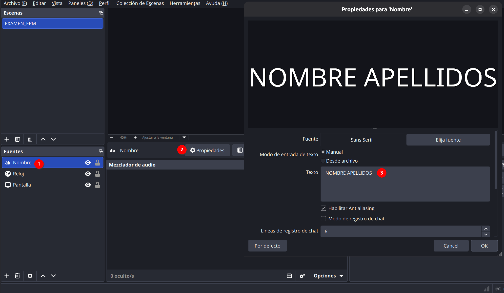
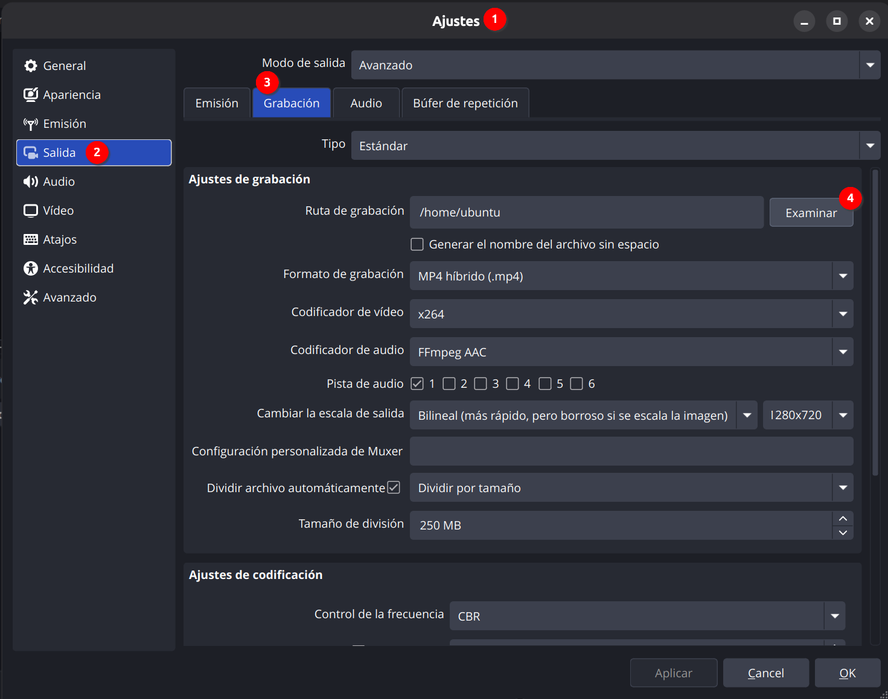

# Manual: configurar OBS para grabar el examen

Este manual te explica cómo dejar OBS listo para grabar tu pantalla durante el examen, con el reloj del sistema y tu nombre siempre visibles. Solo tienes que escribir tu nombre y elegir la carpeta donde se guardará el vídeo. Todo lo demás ya viene configurado.

## Antes de empezar

Necesitas:

- **OBS Studio** instalado. Si no lo tienes, descárgalo gratis desde [obsproject.com](https://obsproject.com/es/download).
- El archivo **`EXAMEN_OBS.zip`** que te habrá pasado tu profesor/a.

**Descomprime el zip** antes de continuar (clic derecho → *Extraer todo* en Windows, doble clic en macOS). Tendrás una carpeta con:

- `Escen_EXAMEN_EPM.json` → la colección de escenas (reloj y nombre)
- `Perf_EXAMEN_EPM` → la carpeta del perfil (ajustes de grabación)

⚠️ No intentes importar directamente desde dentro del zip sin descomprimirlo: OBS no lo encontrará.

---

## Paso 1 — Instalar OBS e importar la plantilla

1. Instala OBS Studio si no lo tienes.
2. Abre OBS.
3. Importa el perfil: menú **Perfil → Importar** y selecciona la carpeta **`Perf_EXAMEN_EPM`**. Después, abre otra vez el menú **Perfil** y haz clic en **Perf_EXAMEN_EPM** para activarlo (importar no lo activa).
4. Importa la colección de escenas: menú **Colección de escenas → Importar**, pulsa el botón **…** para buscar el archivo **`Escen_EXAMEN_EPM.json`** y acepta. Después, abre otra vez el menú **Colección de escenas** y haz clic en **Escen_EXAMEN_EPM** para activarla.

La plantilla trae una fuente llamada **"Pantalla"** preparada para Linux. Si usas **Windows o macOS** (o Linux sin Wayland), al activar la colección aparecerá un aviso de que falta esa fuente. Es normal: se soluciona así.

1. Cierra el aviso.
2. En el panel **Fuentes**, selecciona **"Pantalla"** y bórrala con el botón de la papelera.
3. Pulsa el botón **+** y elige la captura de pantalla completa de tu sistema:

- Windows → **Captura de pantalla**
- macOS → **Captura de pantalla de macOS**
- Linux con Wayland → **Captura de pantalla (PipeWire)** (ya viene en la plantilla; OBS te pedirá elegir qué pantalla compartir)
- Linux con X11 → **Captura de pantalla (XSHM)**

4. Llámala **"Pantalla"** y acepta.
5. Asegúrate de que queda **la última** de la lista de fuentes, debajo de "Nombre" y "Reloj". Si queda arriba, tapará el nombre y el reloj: arrástrala hacia abajo o usa la flecha ↓.

---

## Paso 2 — Comprobar que el reloj aparece

La plantilla ya incluye una fuente de tipo **Navegador** llamada **"Reloj"**, con el reloj ya integrado (no necesitas ningún archivo aparte ni conexión a internet). No tienes que crearla ni tocarla, solo comprobar que aparece en la esquina de la pantalla en la vista previa:

Si no la ves, comprueba que el ojo junto a la fuente "Reloj" en el panel **Fuentes** está activado. Si aun así no aparece, avisa a tu profesor/a.

---

## Paso 3 — Escribir tu nombre

1. En el panel **Fuentes**, busca la fuente de texto llamada **"Nombre"**.
2. Haz doble clic sobre ella (o selecciónala y pulsa **Propiedades**).
3. Borra el texto de ejemplo **"NOMBRE APELLIDOS"**.
4. Escribe tu nombre y apellidos reales.
5. Cierra la ventana de propiedades.

⚠️ Importante: la fuente debe ser de tipo **Texto (FreeType 2)**. Si por error creas una nueva y tu sistema te ofrece **Texto (GDI+)**, no la uses — esa variante solo existe en Windows y en Mac/Linux no aparecerá.

---

## Paso 4 — Elegir dónde se guarda el vídeo

La resolución, los FPS (1) y el formato de grabación (MP4) ya vienen preconfigurados en el perfil que has importado. No cambies nada en **Ajustes → Vídeo**.

Lo único que debes revisar es la carpeta donde se guardará la grabación:

1. Abre **Ajustes → Salida** y ve a la pestaña **Grabación**.
2. En **Ruta de grabación**, pulsa **Examinar** y elige tu carpeta **Vídeos** (o la que te indique tu profesor/a).
3. Pulsa **OK**. No toques ningún otro ajuste de esa pantalla.

---

## Paso 5 — Grabar el examen

1. Comprueba en la vista previa de OBS que se ven **tu nombre** y **el reloj con los segundos** en la esquina de la pantalla.
2. Pulsa **Iniciar grabación**.
3. Realiza el examen con normalidad.
4. Al terminar, pulsa **Detener grabación**.
5. Sube el archivo de vídeo resultante (está en la carpeta que elegiste en el paso 4) junto con la solución del examen, tal como te indique tu profesor/a.

⚠️ Si la grabación es muy larga, OBS la divide automáticamente en varios archivos (cada uno de unos 250 MB, lo que equivale a más de 3 horas de grabación). En ese caso tendrás varios vídeos con la fecha y hora en el nombre: **súbelos todos**, no solo el último.

